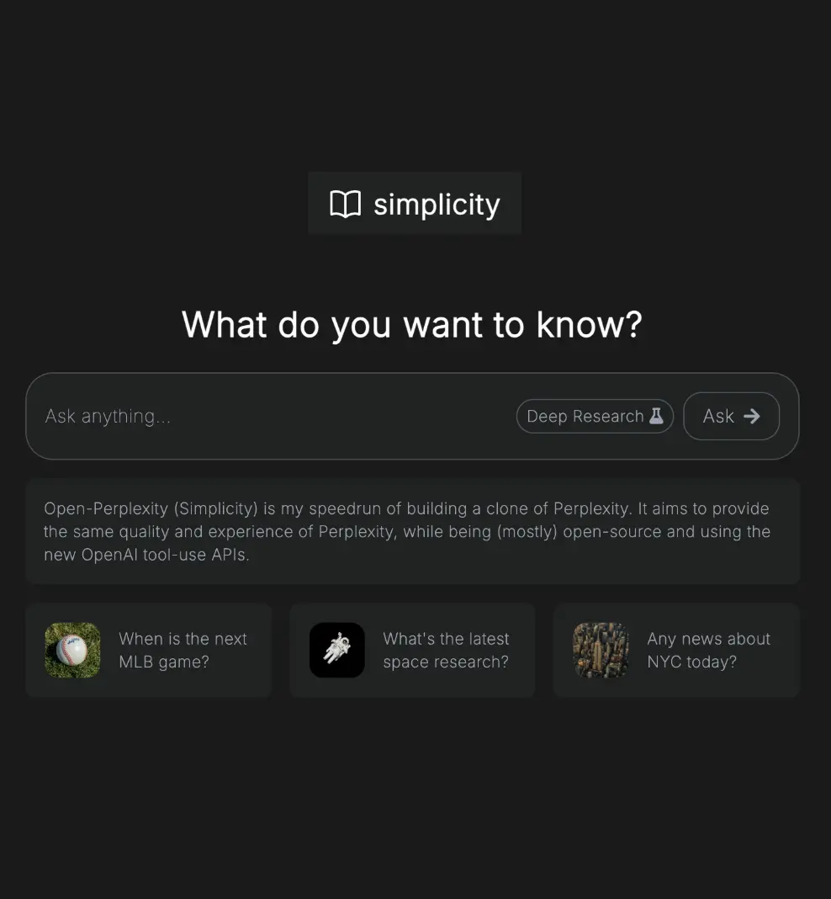
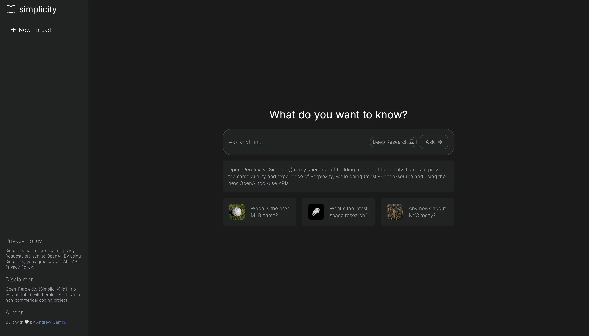
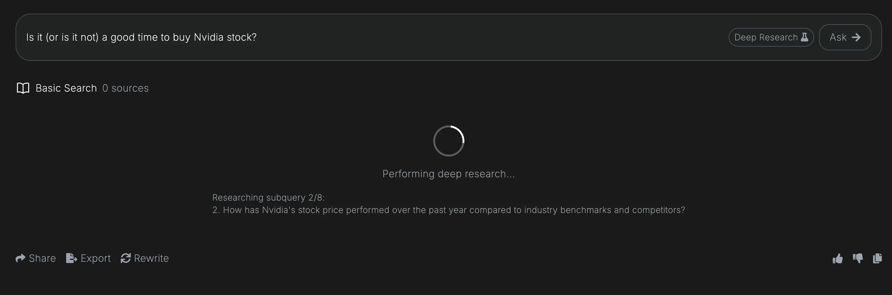
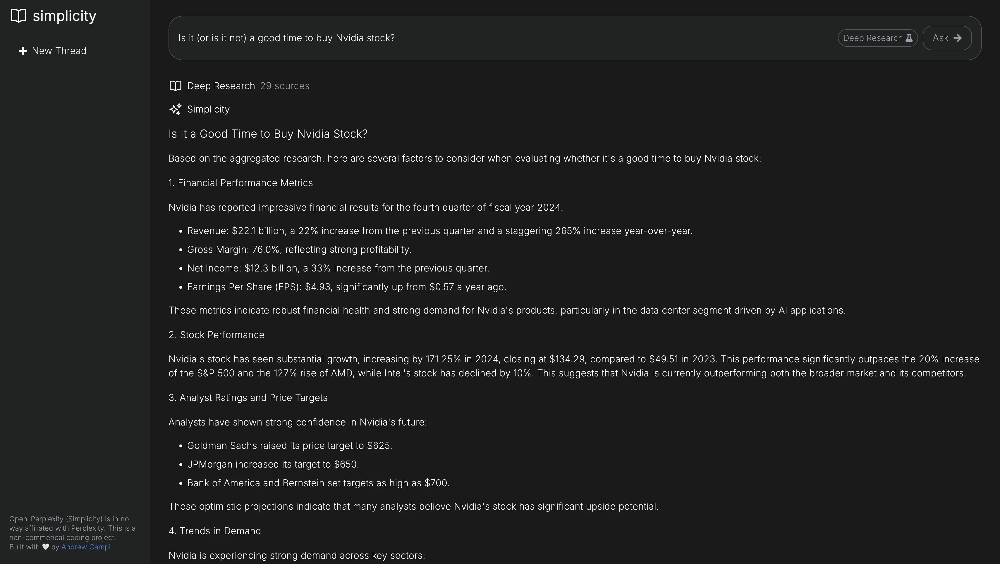

# Open-Perplexity (Simplicity)

An open-source clone of Perplexity built with Python3, LangChain, and OpenAI's Web Search API. This project demonstrates how to create a powerful research assistant that can perform both quick searches and deep research using modern AI technologies.



## Features

- **Fast and Intelligent Responses**: Powered by GPT-4o-mini for quick and accurate answers
- **Web Search Integration**: Utilizes OpenAI's Web Search API for real-time information retrieval
- **Deep Research Mode**: Built with LangChain, breaks down complex queries into subqueries for comprehensive research
- **Modern UI**: Clean, responsive interface with real-time typing animations
- **Source Attribution**: All responses include clickable source links
- **Export & Share**: Easy export of research results and shareable URLs



## Deep Research Mode

When activated, the Deep Research mode:
1. Breaks down complex queries into focused subqueries
2. Researches each subquery independently
3. Synthesizes findings into a comprehensive answer
4. Provides consolidated sources from all research paths



## Example Output

The system provides detailed, well-formatted responses with markdown support and source attribution.



## Setup Instructions

1. **Install Python 3.11**
   - For macOS: `brew install python@3.11`
   - For Ubuntu: `sudo apt install python3.11`
   - For Windows: Download from [Python.org](https://www.python.org/downloads/)

2. **Clone the Repository**
   ```bash
   git clone https://github.com/yourusername/open-perplexity.git
   cd open-perplexity
   ```

3. **Create Environment File**
   Create a `.env` file in the project root with your OpenAI API key:
   ```
   OPENAI_API_KEY="your-openai-api-key-here"
   ```

4. **Set Up Virtual Environment**
   ```bash
   python3 -m venv venv
   source venv/bin/activate  # On Windows: .\venv\Scripts\activate
   ```

5. **Install Dependencies**
   ```bash
   python3 -m pip install -r requirements.txt
   ```

6. **Run the Application**
   ```bash
   python3 app.py
   ```

   The application will be available at `http://localhost:8080`

## Disclaimer

Open-Perplexity (Simplicity) is not affiliated with Perplexity. This is a non-commercial coding project created for educational purposes.

## License

This project is open source and available under the MIT License.

## Acknowledgments

Built with 🤍 by [Andrew Campi](https://github.com/andrewcampi). 